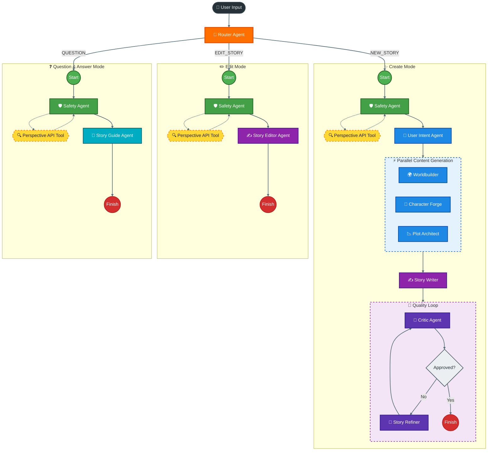

# Story Crafter Architecture & Flow

This diagram represents the high-level control flow and the internal logic of the Story Crafter agents.

```mermaid
graph TD
    %% Nodes and Styles
    User([👤 User Input]):::userInput
    Router[🚦 Router Agent]:::routerNode
    
    %% Main Decision Branches
    User --> Router
    Router -- "NEW_STORY" --> StartCreate
    Router -- "EDIT_STORY" --> StartEdit
    Router -- "QUESTION" --> StartQA

    %% 1. Create New Story Flow (Complex)
    subgraph CreateFlow [✨ Create Mode]
        direction TB
        StartCreate((Start)):::startNode
        Safety1[🛡️ Safety Agent]:::safetyNode
        Perspective1{{🔍 Perspective API Tool}}:::toolNode
        Intent[🧠 User Intent Agent]:::genNode
        
        subgraph ParallelGen [⚡ Parallel Content Generation]
            direction LR
            World[🌍 Worldbuilder]:::genNode
            Char[👥 Character Forge]:::genNode
            Plot[📉 Plot Architect]:::genNode
        end
        
        Writer[✍️ Story Writer]:::writerNode
        
        subgraph QualityLoop [🔄 Quality Loop]
            direction TB
            Critic[🧐 Critic Agent]:::loopNode
            Refiner[📝 Story Refiner]:::loopNode
            Approved{Approved?}:::decisionNode
            
            Critic --> Approved
            Approved -- No --> Refiner
            Refiner --> Critic
            Approved -- Yes --> DoneCreate((Finish)):::endNode
        end

        StartCreate --> Safety1
        Safety1 -.-> Perspective1
        Perspective1 -.-> Safety1
        Safety1 --> Intent
        Intent --> ParallelGen
        ParallelGen --> Writer
        Writer --> QualityLoop
    end

    %% 2. Edit Flow (Fast)
    subgraph EditFlow [✏️ Edit Mode]
        direction TB
        StartEdit((Start)):::startNode
        Safety2[🛡️ Safety Agent]:::safetyNode
        Perspective2{{🔍 Perspective API Tool}}:::toolNode
        Editor[✍️ Story Editor Agent]:::writerNode
        DoneEdit((Finish)):::endNode

        StartEdit --> Safety2
        Safety2 -.-> Perspective2
        Perspective2 -.-> Safety2
        Safety2 --> Editor
        Editor --> DoneEdit
    end

    %% 3. Question Flow (Fast)
    subgraph QAFlow [❓ Question & Answer Mode]
        direction TB
        StartQA((Start)):::startNode
        Safety3[🛡️ Safety Agent]:::safetyNode
        Perspective3{{🔍 Perspective API Tool}}:::toolNode
        StoryGuide[🤖 Story Guide Agent]:::qaNode
        DoneQA((Finish)):::endNode

        StartQA --> Safety3
        Safety3 -.-> Perspective3
        Perspective3 -.-> Safety3
        Safety3 --> StoryGuide
        StoryGuide --> DoneQA
    end

    %% Styling (Material Design / Modern Palette)
    %% Nodes
    classDef userInput fill:#263238,stroke:#37474F,color:#ECEFF1,stroke-width:2px;
    classDef routerNode fill:#FF6F00,stroke:#E65100,color:#FFFFFF,stroke-width:3px;
    
    classDef safetyNode fill:#43A047,stroke:#1B5E20,color:#FFFFFF,stroke-width:2px;
    classDef toolNode fill:#FDD835,stroke:#F57F17,color:#212121,stroke-width:2px,stroke-dasharray: 5 5;
    
    classDef genNode fill:#1E88E5,stroke:#0D47A1,color:#FFFFFF,stroke-width:2px;
    classDef writerNode fill:#8E24AA,stroke:#4A148C,color:#FFFFFF,stroke-width:2px;
    classDef qaNode fill:#00ACC1,stroke:#006064,color:#FFFFFF,stroke-width:2px;
    classDef loopNode fill:#5E35B1,stroke:#311B92,color:#FFFFFF,stroke-width:2px;
    
    classDef startNode fill:#4CAF50,stroke:#1B5E20,color:#FFFFFF,stroke-width:2px;
    classDef endNode fill:#D32F2F,stroke:#B71C1C,color:#FFFFFF,stroke-width:2px;
    classDef decisionNode fill:#ECEFF1,stroke:#455A64,color:#263238,stroke-width:2px;

    %% Subgraphs
    classDef parallel fill:#E3F2FD,stroke:#1565C0,stroke-width:2px,stroke-dasharray: 5 5;
    classDef loop fill:#F3E5F5,stroke:#8E24AA,stroke-width:2px,stroke-dasharray: 5 5;

    class ParallelGen parallel;
    class QualityLoop loop;
    
    %% Links
    linkStyle default stroke:#546E7A,stroke-width:2px;
```
