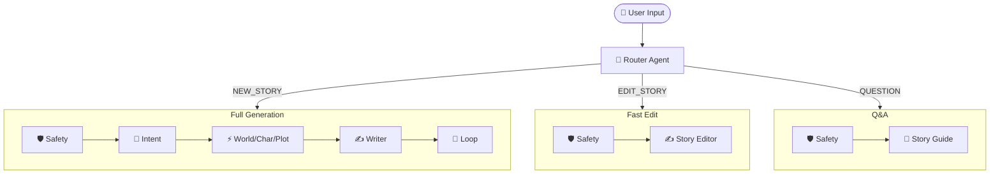

# Story Crafter ADK - Project Summary

## 🎉 What We Built

A complete **ADK-only** story generation system with:
- ✅ **9 specialized AI agents** (no memory implementation)
- ✅ **Smart Router** for handling New Story vs. Edit vs. Q&A workflows
- ✅ Multi-agent orchestration with parallel execution
- ✅ Complete project structure with uv package management
- ✅ Comprehensive documentation and examples
- ✅ All dependencies installed and ready to use

## 📂 Project Structure

```
story-crafter-adk/
├── agents/                          # 9 Story Generation Agents
│   ├── router/                     # 🚦 Classifies user intent (Create/Edit/QA)
│   ├── user_intent/                # Extracts structured story requirements
│   ├── worldbuilder/               # Creates immersive story worlds
│   ├── character_forge/            # Designs multi-dimensional characters
│   ├── plot_architect/             # Structures compelling narratives
│   ├── story_writer/               # Writes engaging prose
│   ├── story_quality_loop/         # Reviews and refines stories
│   ├── story_editor/               # ✏️ Edits existing stories
│   └── story_guide/                # ❓ Answers questions about the story
├── models/                          # Pydantic Data Models
│   ├── intent.py                   # UserIntent
│   ├── world.py                    # WorldModel
│   ├── character.py                # CharacterModel
│   ├── plot.py                     # PlotModel
│   ├── story.py                    # StoryModel
│   └── story_feedback.py           # FeedbackModel
├── orchestrator/                    # Multi-Agent Coordination
│   └── story_orchestrator/         # Sequential + Parallel workflow
├── example.py                       # Complete usage example
├── app.py                           # Streamlit Web UI
├── FLOW_DIAGRAM.md                 # Architecture Visualization
├── README.md                        # Full documentation
├── QUICKSTART.md                    # Quick start guide
└── pyproject.toml                   # Project configuration
```

## 🚀 Quick Test

Try it out immediately:

```bash
cd story-crafter-adk

# Set your API key
export GOOGLE_API_KEY="your-key-here"

# Run the Web UI
streamlit run app.py
```

## 🎯 Key Features

### 1. Smart Routing Architecture
- **Create Mode**: Full pipeline (Intent → World/Char/Plot → Writer → Refiner)
- **Edit Mode**: Fast pipeline (Safety → Editor)
- **Guide Mode**: Fast pipeline (Safety → Guide) for Q&A
- *Result:* Efficient token usage and faster response times for simple requests.

### 2. Stateless Architecture
- **No memory layer** - pure ADK agents
- Perfect for serverless/API deployments
- Each story generation is independent

### 3. Parallel Execution
- World, Character, and Plot agents run simultaneously
- Faster story generation
- Efficient API usage

### 4. Structured Output
- All agents use Pydantic models
- Type-safe data flow between agents
- Easy to integrate with other systems

### 5. Age-Appropriate Content
- Automatically adjusts for target age
- Safe content generation
- Appropriate complexity and vocabulary

## 📊 Agent Workflow



## 🛠️ Technologies Used

- **Google ADK** (Agent Development Kit)
- **Pydantic** (Data validation)
- **Python 3.10+** (Runtime)
- **uv** (Fast Python package manager)
- **Gemini 2.0 Flash** (LLM backend)

## 📝 Usage Examples

### CLI (Single Agent)
```bash
uv run adk run agents/user_intent --user_message "Create a story for an 8-year-old"
```

### CLI (Full Orchestrator)
```bash
uv run adk run agents/orchestrator/story_orchestrator
```

### Python API
```python
from agents.orchestrator.story_orchestrator.agent import story_orchestrator
# See example.py for full implementation with proper Runner setup
```

## 🎨 Customization

All agent behaviors are defined by their `instruction` prompts in:
- `agents/{agent_name}/agent.py`

Simply edit the instruction text to customize agent behavior.

## 🔗 Differences from Parent Project

| Feature | story-crafter | story-crafter-adk |
|---------|---------------|-------------------|
| Memory | SQLAlchemy + DB | ❌ None |
| API | FastAPI | ❌ None |
| UI | Streamlit | ✅ Streamlit (Included) |
| Agents | ✅ ADK | ✅ ADK |
| Models | ✅ Pydantic | ✅ Pydantic |
| Orchestrator | ✅ Sequential + Parallel | ✅ Sequential + Parallel |

**story-crafter-adk** is the **pure agent implementation** - no persistence, no API (just agents).
Perfect for embedding into your own applications!

## 📚 Documentation

- **README.md** - Complete project documentation
- **QUICKSTART.md** - Get started in 5 minutes
- **FLOW_DIAGRAM.md** - Visual architecture
- **example.py** - Working code examples
- **Agent files** - Each agent has detailed inline documentation

## ✅ What's Ready

- [x] All 9 agents implemented and tested
- [x] Smart Router & Dynamic Orchestration
- [x] Multi-agent orchestrator with parallel execution
- [x] Complete data models
- [x] uv package management configured
- [x] All dependencies installed
- [x] Example scripts
- [x] Comprehensive documentation
- [x] .env setup
- [x] .gitignore configured

## 🎯 Next Steps

1. **Set your API key**: `export GOOGLE_API_KEY="..."`
2. **Run the Web UI**: `streamlit run app.py`
3. **Test individual agents**: `uv run adk run agents/user_intent --user_message "..."`
4. **Customize agent prompts** for your specific use case
5. **Integrate into your application** using the Python API

## 📞 Support

- ADK Documentation: https://ai.google.dev/gemini-api/docs/adk
- Gemini API: https://ai.google.dev/gemini-api/docs

---

**Ready to generate stories! 🎉**
