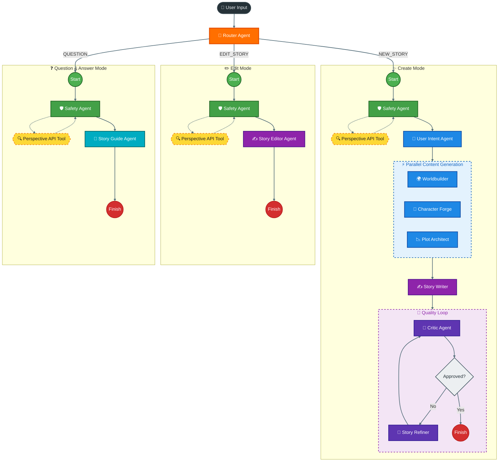
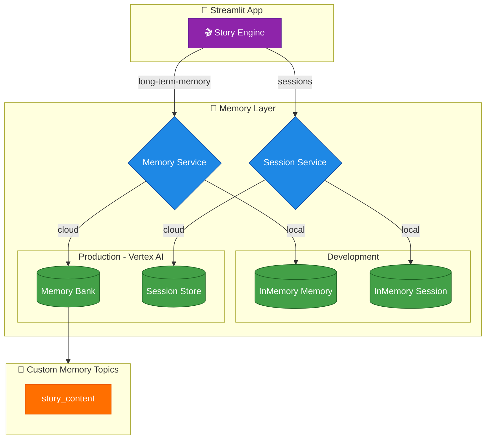
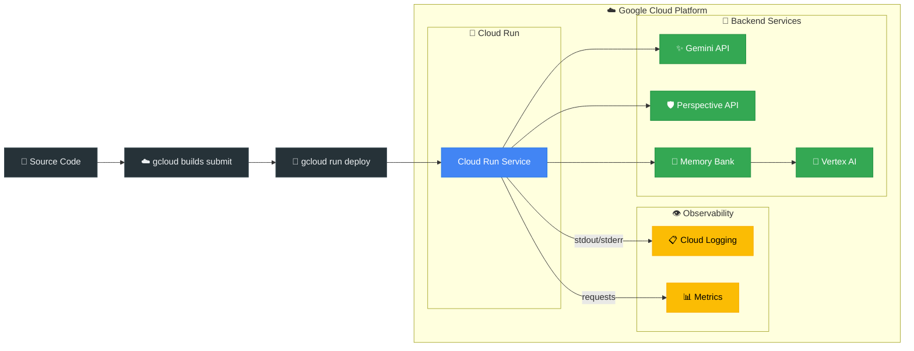

# Story Crafter ADK

A multi-agent storytelling system powered by **Google Agent Development Kit (ADK)**. This application orchestrates specialized AI agents to collaboratively generate age-appropriate, engaging stories through an interactive web interface or CLI.

## 🏛️ Agent Architecture

### Agent Flow Diagram



### Memory Services Architecture



### Cloud Run Deployment & Observability



## 📑 Table of Contents

- [🎯 Overview](#-overview)
  - [Key Capabilities](#key-capabilities)
- [🏛️ Agent Architecture](#️-agent-architecture)
  - [Agent Flow Diagram](#agent-flow-diagram)
  - [Memory Services Architecture](#memory-services-architecture)
  - [Cloud Run Deployment & Observability](#cloud-run-deployment--observability)
- [🏗️ Architecture Details](#️-architecture-details)
  - [Agent Ecosystem](#agent-ecosystem)
  - [Processing Workflows](#processing-workflows)
  - [Orchestration](#orchestration)
- [📁 Project Structure](#-project-structure)
- [🚀 Quick Start](#-quick-start)
  - [Prerequisites](#prerequisites)
  - [Installation](#installation)
  - [Running the Application](#running-the-application)
- [🎨 Usage Examples](#-usage-examples)
  - [Creating a New Story](#creating-a-new-story)
  - [Editing an Existing Story](#editing-an-existing-story)
  - [Asking Questions](#asking-questions)
- [🔧 Configuration](#-configuration)
  - [Model Selection](#model-selection)
  - [Retry Configuration](#retry-configuration)
  - [Quality Loop Settings](#quality-loop-settings)
  - [Perspective API](#perspective-api)
- [📊 Data Models](#-data-models)
- [☁️ Google Cloud Deployment](#️-google-cloud-deployment)
  - [Build the Container](#build-the-container)
  - [Run Locally](#run-locally)
  - [Deploy to Google Cloud Run](#deploy-to-google-cloud-run)
  - [Test with Port Forwarding](#test-with-port-forwarding)
- [🧪 Development](#-development)
  - [Running Tests](#running-tests)
  - [Evaluations Framework](#evaluations-framework)
- [🎓 How It Works](#-how-it-works)
  - [Story Generation Flow](#story-generation-flow)
  - [Quality Loop Details](#quality-loop-details)
  - [Parallel Processing](#parallel-processing)
- [💡 Tips & Best Practices](#-tips--best-practices)
- [🤝 Contributing](#-contributing)
- [📄 License](#-license)
- [🔗 Related Resources](#-related-resources)
- [🙏 Acknowledgments](#-acknowledgments)

## 🎯 Overview

Story Crafter ADK is an intelligent story generation system that uses multiple specialized AI agents working together to create rich narratives. The system features smart routing, parallel processing, and iterative quality refinement to produce polished, age-appropriate stories.

### Key Capabilities

- **Smart Routing**: Automatically classifies user input to determine whether to create a new story, edit an existing one, or answer questions
- **Multi-Agent Collaboration**: Specialized agents handle different aspects of storytelling (world-building, character development, plot structure, prose writing)
- **Parallel Processing**: World, character, and plot generation happen simultaneously for optimal performance
- **Quality Refinement**: Optional iterative review loop with critic and refiner agents to polish stories
- **Safety-First**: Built-in content safety validation using Google Perspective API (pre-check before any LLM calls)
- **Long-term Memory**: Vertex AI Memory Bank remembers characters, settings, and plot events across sessions for story continuity
- **Flexible Storage**: Supports both in-memory (development) and Vertex AI Memory Bank (production) for session and memory persistence
- **Interactive UI**: Modern Streamlit-based web interface with Google Material Design theme

## 🏗️ Architecture Details

### Agent Ecosystem

The system consists of 10 specialized agents:

1. **Router Agent** (`agents/router/`)
   - Classifies user requests into: NEW_STORY, EDIT_STORY, or QUESTION
   - Uses structured output (RoutingDecision model)
   - Determines optimal processing pipeline

2. **Safety Agent** (`agents/safety/`)
   - Deterministic agent (no LLM) for fast validation
   - Uses Google Perspective API for toxicity checking
   - Blocks unsafe content before processing
   - Raises SafetyViolationError on policy violations

3. **User Intent Agent** (`agents/user_intent/`)
   - Extracts structured requirements from natural language
   - Outputs: age, themes, tone, genre, length_minutes, safety_constraints
   - Uses UserIntent Pydantic model

4. **Worldbuilder Agent** (`agents/worldbuilder/`)
   - Creates immersive story worlds
   - Generates: name, description, rules, locations, aesthetic
   - Uses WorldModel Pydantic model

5. **Character Forge Agent** (`agents/character_forge/`)
   - Designs multi-dimensional characters
   - Generates: name, species, role, physical/personality traits, strengths, weaknesses, motivations, goals, relationships
   - Uses CharacterModel Pydantic model

6. **Plot Architect Agent** (`agents/plot_architect/`)
   - Structures compelling narratives with classic story beats
   - Generates: setup, conflict, rising_action, climax, resolution, themes, episode_hook
   - Uses PlotModel Pydantic model

7. **Story Writer Agent** (`agents/story_writer/`)
   - Transforms structured components into narrative prose
   - Outputs complete stories as formatted text
   - Adjusts language complexity based on target age
   - Uses output_key="current_story" for quality loop integration

8. **Story Quality Loop** (`agents/story_quality_loop/`)
   - Iterative refinement with max 3 iterations
   - **Critic Agent**: Reviews story, outputs "APPROVED" or specific feedback
   - **Refiner Agent**: Revises story based on feedback or exits loop
   - Uses LoopAgent with exit_loop tool

9. **Story Editor Agent** (`agents/story_editor/`)
   - Modifies existing stories based on user feedback
   - Fast pipeline for quick edits

10. **Story Guide Agent** (`agents/story_guide/`)
    - Answers questions about story content
    - Does not modify stories, acts as Q&A expert

### Processing Workflows

The system supports three distinct processing modes, each optimized for different user intents:

#### Create Mode (Full Generation)
```
User Input → Router → Safety → User Intent → [Parallel: World + Characters + Plot] → Story Writer → Quality Loop → Final Story
```

#### Edit Mode (Fast)
```
User Input → Router → Safety → Story Editor → Edited Story
```

#### Question Mode (Q&A)
```
User Input → Router → Safety → Story Guide → Answer
```

### Orchestration

The Story Orchestrator (`agents/orchestrator/story_orchestrator/`) uses ADK's workflow agents:

- **SequentialAgent**: For linear processing (safety → intent → writer)
- **ParallelAgent**: For concurrent execution (world + characters + plot)
- **LoopAgent**: For iterative refinement (critic ↔ refiner)

The orchestrator dynamically switches modes based on routing decisions.

## 📁 Project Structure

```
story-crafter-adk/
├── agents/                      # AI agent modules
│   ├── router/                  # Request classification
│   ├── safety/                  # Content safety validation
│   ├── user_intent/             # Intent extraction
│   ├── worldbuilder/            # World generation
│   ├── character_forge/         # Character creation
│   ├── plot_architect/          # Plot structuring
│   ├── story_writer/            # Prose generation
│   ├── story_quality_loop/      # Iterative refinement
│   ├── story_editor/            # Story modification
│   ├── story_guide/             # Q&A handler
│   └── orchestrator/
│       └── story_orchestrator/  # Multi-agent coordination
├── models/                      # Pydantic data models
│   ├── intent.py                # UserIntent
│   ├── world.py                 # WorldModel
│   ├── character.py             # CharacterModel
│   ├── plot.py                  # PlotModel
│   └── routing.py               # RoutingDecision
├── services/                    # Backend services
│   ├── llm.py                   # Gemini model factory with retry config
│   ├── memory.py                # In-memory session service
│   ├── perspective.py           # Perspective API integration
│   └── story_engine.py          # Story processing engine
├── evals/                       # Evaluation framework
│   ├── datasets.py              # Test cases and datasets
│   ├── metrics.py               # Evaluation metrics
│   └── runner.py                # Eval orchestrator
├── ui/                          # UI components
│   └── theme.py                 # Google Material Design theme
├── tests/                       # Test suite
├── app.py                       # Streamlit web application
├── pyproject.toml              # Project dependencies
├── uv.lock                     # Lock file for uv package manager
├── Dockerfile                  # Container build configuration
└── README.md                   # This file
```

## 🚀 Quick Start

### Prerequisites

- **Python**: 3.10, 3.11, or 3.12
- **uv**: Fast Python package manager ([install instructions](https://docs.astral.sh/uv/))
- **Google API Key**: For Gemini models (set as `GOOGLE_API_KEY` environment variable)

#### Optional: Vertex AI Agent Engine (for Production)

For persistent memory and sessions using Vertex AI Memory Bank, you'll also need:

- **Google Cloud Project** with Vertex AI API enabled
- **Agent Engine** created via `scripts/create_agent_engine.py`

Set these environment variables:
```bash
export GOOGLE_CLOUD_PROJECT="your-project-id"
export GOOGLE_CLOUD_LOCATION="us-central1"
export AGENT_ENGINE_ID="your-agent-engine-id"
```

#### Optional: Perspective API (for Content Safety)

For content safety validation before LLM processing:

- **Perspective API Key**: Enable the [Perspective API](https://developers.perspectiveapi.com/) in Google Cloud Console

The same `GOOGLE_API_KEY` is used for both Gemini and Perspective API. If not configured, safety checks are skipped with a warning (safe for development).

### Installation

1. **Clone the repository** (or navigate to project directory):
   ```bash
   cd story-crafter-adk
   ```

2. **Install dependencies using uv**:
   ```bash
   uv sync
   ```
   
   This installs:
   - `google-adk>=0.2.0` - Agent Development Kit
   - `fastapi>=0.121.2` - Web framework
   - `streamlit>=1.51.0` - UI framework
   - `pydantic>=2.9.0` - Data validation
   - `python-dotenv>=1.0.1` - Environment management
   - `uvicorn>=0.38.0` - ASGI server

3. **Set your Google API key** by copying the example file:
   ```bash
   cp .env.example .env
   # Edit .env and add your API key, and other configs
   ```

### Running the Application

#### Option 1: Streamlit Web Interface (Recommended)

Launch the interactive web UI with Google Material Design theme:

```bash
uv run streamlit run app.py
```

Then open your browser to `http://localhost:8501`

**Features**:
- Interactive chat interface
- Real-time status updates
- Collapsible sections for drafts, critiques, and refinements
- Session management
- Toggle quality refinement on/off
- Story history with avatars and formatting

#### Option 2: ADK CLI (Interactive)

Run the full orchestrator in terminal:

```bash
uv run adk run agents/orchestrator/story_orchestrator
```

Or use the ADK web interface:

```bash
uv run adk web agents/
```

#### Option 3: Individual Agents (Testing)

Test agents independently:

```bash
# Extract user intent
uv run adk run agents/user_intent --user_message "Create a 5-minute bedtime story for an 8-year-old about mermaids"

# Generate a world
uv run adk run agents/worldbuilder

# Create characters
uv run adk run agents/character_forge

# Design a plot
uv run adk run agents/plot_architect

# Write a story
uv run adk run agents/story_writer
```

## 🎨 Usage Examples

### Creating a New Story

**User Input**: "Tell me an exciting space adventure for a 10-year-old, about 10 minutes long"

**Processing**:
1. Router classifies as NEW_STORY
2. Safety agent validates content
3. User Intent extracts: age=10, themes=["space", "adventure"], genre="sci-fi", length_minutes=10
4. Parallel generation creates world, characters, and plot
5. Story Writer produces narrative prose
6. Quality Loop refines (if enabled)

### Editing an Existing Story

**User Input**: "Make it funnier and change the character's name to Luna"

**Processing**:
1. Router classifies as EDIT_STORY
2. Safety agent validates
3. Story Editor modifies the current_story
4. Returns updated story

### Asking Questions

**User Input**: "Why did the captain make that decision?"

**Processing**:
1. Router classifies as QUESTION
2. Safety agent validates
3. Story Guide analyzes current_story and responds

## 🔧 Configuration

### Model Selection

All agents use `gemini-2.0-flash-exp` by default, except:
- **Quality Critic**: Uses `gemini-2.0-flash-thinking-exp` for deeper analysis

To change models, edit the agent's `create_agent()` function in `agents/{agent_name}/agent.py`:

```python
def create_agent():
    return Agent(
        name="agent_name",
        model=create_gemini_model("gemini-2.5-flash"),  # Change here
        # ...
    )
```

### Retry Configuration

The `services/llm.py` module configures automatic retries for API calls:
- **Max attempts**: 5
- **Initial delay**: 1 second
- **Exponential base**: 7
- **Retry on**: HTTP 429, 500, 503, 504

### Quality Loop Settings

In `agents/story_quality_loop/agent.py`:
- **Max iterations**: 1 (configurable via LoopAgent parameter)
- **Critic strictness**: Very strict by default (score > 9.8/10 to approve)

### Perspective API

The `services/perspective.py` module handles safety:
- **Toxicity threshold**: 0.7 (configurable)
- **Fallback**: If no API key is set, defaults to safe (logs warning)
- **Raises**: SafetyViolationError on violations

## ☁️ Google Cloud Deployment

### Build the Container

```bash
gcloud builds submit --tag gcr.io/YOUR_PROJECT_ID/story-crafter-adk .
```

### Run Locally

```bash
docker run -p 8080:8080 -e GOOGLE_API_KEY="your-api-key" story-crafter-adk
```

### Deploy to Google Cloud Run

**Basic deployment (development)**:
```bash
gcloud run deploy story-crafter-adk \
  --source . \
  --region us-central1 \
  --set-env-vars GOOGLE_API_KEY="your-api-key" \
  --no-allow-unauthenticated
```

**Production deployment with Memory Bank**:
```bash
gcloud run deploy story-crafter-adk \
  --source . \
  --region us-central1 \
  --set-env-vars GOOGLE_API_KEY="your-api-key" \
  --set-env-vars GOOGLE_CLOUD_PROJECT="your-project-id" \
  --set-env-vars GOOGLE_CLOUD_LOCATION="us-central1" \
  --set-env-vars AGENT_ENGINE_ID="your-agent-engine-id" \
  --no-allow-unauthenticated
```

### Test with Port Forwarding

Since the Cloud Run service requires authentication, use `gcloud run services proxy` to create a local tunnel:

**Start the proxy**:
```bash
# Port forward to localhost:8080
gcloud run services proxy story-crafter-adk \
  --region us-central1 \
  --port 8080
```

This creates an authenticated tunnel using your gcloud credentials. The service will be available at `http://localhost:8080`.

**Access the app**:
```bash
# Open in browser
open http://localhost:8080

# Or test with curl
curl http://localhost:8080
```

**Viewing logs**: Application logs can be viewed in the [Cloud Run Logs](https://console.cloud.google.com/run) section of the Google Cloud Console.

## 🧪 Development

### Running Tests

```bash
uv run pytest
```

### Evaluations Framework

Story Crafter includes a comprehensive evaluation framework in `evals/` for systematic testing of agent behavior:

#### Running Evaluations

```bash
# Set your API key
export GOOGLE_API_KEY="your-api-key-here"

# Run evals against actual LLM (via CLI runner)
uv run python -m evals.runner

```

#### Available Metrics

| Metric | Description |
|--------|-------------|
| `RouteAccuracy` | Validates router classification (NEW_STORY/EDIT_STORY/QUESTION) |
| `StructuredOutputValidity` | Validates Pydantic schema conformance |
| `StoryQualityScore` | Heuristic or LLM-based story quality evaluation |
| `SafetyCompliance` | Validates safety agent decisions (PASS/BLOCK) |
| `AgeAppropriatenessScore` | Readability analysis for target age |

#### Eval Datasets

- **ROUTER_CASES**: Tests for request classification
- **INTENT_CASES**: Tests for user intent extraction
- **SAFETY_CASES**: Tests for content safety validation
- **E2E_CASES**: End-to-end story quality tests

Results are saved to `eval_results/` as JSON files.

## 📄 License

See the main Story Crafter project for licensing information.

## 🔗 Related Resources

- **Google ADK**: [Agent Development Kit Documentation](https://ai.google.dev/gemini-api/docs/adk)
- **Google Gemini**: [Gemini API Documentation](https://ai.google.dev/gemini-api)
- **Perspective API**: [Content Safety Documentation](https://developers.perspectiveapi.com/)
- **Streamlit**: [Streamlit Documentation](https://docs.streamlit.io/)
- **uv**: [uv Package Manager](https://docs.astral.sh/uv/)

## 🙏 Acknowledgments

Built with ❤️ using:
- Google Agent Development Kit (ADK)
- Google Gemini API
- Google Perspective API
- Streamlit
- Pydantic

---

**Note**: By default, this uses in-memory storage for development. For production with persistent sessions and memories, configure Vertex AI Memory Bank by setting the environment variables (`GOOGLE_CLOUD_PROJECT`, `GOOGLE_CLOUD_LOCATION`, `AGENT_ENGINE_ID`) and using the setup scripts in `scripts/`.
