# Story Crafter ADK

A multi-agent storytelling system powered by the **Google Agent Development Kit (ADK)**. This version focuses purely on the agent-based architecture without memory persistence, making it ideal for stateless story generation workflows.

## 🎯 Overview

Story Crafter ADK orchestrates multiple AI agents to collaboratively generate rich, age-appropriate stories. Each agent specializes in a specific aspect of storytelling:

- **Router Agent**: Smartly classifies user input (Create, Edit, or Question) to route to the correct pipeline.
- **User Intent Agent**: Extracts structured requirements from natural language requests
- **Worldbuilder Agent**: Creates immersive story worlds with rules, locations, and aesthetics
- **Character Forge Agent**: Designs multi-dimensional characters with personalities and motivations
- **Plot Architect Agent**: Structures compelling narratives with proper story beats
- **Story Writer Agent**: Transforms structured components into engaging prose
- **Story Quality Loop**: Iteratively reviews and refines stories for quality.
- **Story Editor Agent**: Handles requests to rewrite or modify existing stories.
- **Story Guide Agent**: Answers questions about the story world without modifying the text.
- **Safety Agent**: Ensures all content is safe and age-appropriate.

## 🚀 Quick Start

### Prerequisites

- Python 3.10 or higher
- [uv](https://docs.astral.sh/uv/) package manager
- Google ADK installed
- API key for Gemini models (set as `GOOGLE_API_KEY` environment variable)

### Installation

1. Clone or navigate to the project directory:
```bash
cd story-crafter-adk
```

2. Install dependencies using uv:
```bash
uv sync
```

3. Set up your Google API key:
```bash
export GOOGLE_API_KEY="your-api-key-here"
```

Or create a `.env` file:
```bash
echo "GOOGLE_API_KEY=your-api-key-here" > .env
```

## 🎨 Usage

### Running the Full Orchestrator

Generate a complete story with all agents working together:

```bash
uv run adk run agents/orchestrator/story_orchestrator
```

Then interact with the agent in the CLI, or use the web interface:

```bash
adk web agents/
```

### Running the Web UI (Streamlit)

Launch the interactive web interface to generate stories:

1. Install Streamlit (if not already installed):
   ```bash
   uv add streamlit
   # or
   pip install streamlit
   ```

2. Run the app:
   ```bash
   streamlit run app.py
   ```

### Running Individual Agents

Test or use individual agents independently:

**User Intent Agent:**
```bash
uv run adk run agents/user_intent --user_message "I want an exciting space adventure for a 10-year-old"
```

**Worldbuilder Agent:**
```bash
uv run adk run agents/worldbuilder --user_message "Create a fantasy underwater world with magical properties"
```

**Character Forge Agent:**
```bash
uv run adk run agents/character_forge --user_message "Design a brave protagonist for an underwater adventure story"
```

**Plot Architect Agent:**
```bash
uv run adk run agents/plot_architect --user_message "Create a plot about overcoming fear in a magical underwater world"
```

**Story Writer Agent:**
```bash
uv run adk run agents/story_writer --user_message "Write a 5-minute story about a mermaid who discovers courage"
```

### Using in Python

```python
import asyncio
from agents.orchestrator.story_orchestrator.agent import story_orchestrator

async def generate_story():
    # See example.py for full implementation with proper Runner setup
    # ...
    pass
```

## 📁 Project Structure

```
story-crafter-adk/
├── agents/                    # Individual story generation agents
│   ├── router/               # Routes requests (Create vs Edit vs QA)
│   ├── user_intent/          # Extracts structured intent from requests
│   ├── worldbuilder/         # Creates story worlds
│   ├── character_forge/      # Designs characters
│   ├── plot_architect/       # Structures plots
│   ├── story_writer/         # Writes narrative prose
│   ├── story_quality_loop/   # Reviews and refines stories
│   ├── story_editor/         # Edits existing stories
│   └── story_guide/          # Answers questions about the story
├── models/                    # Pydantic data models
│   ├── intent.py             # UserIntent model
│   ├── world.py              # WorldModel
│   ├── character.py          # CharacterModel
│   ├── plot.py               # PlotModel
│   ├── story.py              # StoryModel
│   └── story_feedback.py     # FeedbackModel
├── orchestrator/              # Multi-agent orchestration
│   └── story_orchestrator/   # Sequential + parallel workflow
├── pyproject.toml            # Project configuration
└── README.md                 # This file
```

## 🧩 Architecture

### Smart Routing Workflow

The system now uses a **Router Agent** to determine the user's intent and select the efficient pipeline:

```mermaid
graph TD
    User([👤 User Input]) --> Router[🚦 Router Agent]
    
    Router -- "NEW_STORY" --> Create[✨ Create Mode]
    Router -- "EDIT_STORY" --> Edit[✏️ Edit Mode]
    Router -- "QUESTION" --> Guide[❓ Guide Mode]

    subgraph Create [Full Generation]
        Safety1[🛡️ Safety] --> Intent[🧠 Intent]
        Intent --> Parallel[⚡ World/Char/Plot]
        Parallel --> Writer[✍️ Writer]
        Writer --> Quality[🔄 Loop]
    end

    subgraph Edit [Fast Edit]
        Safety2[🛡️ Safety] --> Editor[✍️ Story Editor]
    end

    subgraph Guide [Q&A]
        Safety3[🛡️ Safety] --> GuideAgent[🤖 Story Guide]
    end
```



### Key Features

- **Smart Routing**: Distinguishes between creating new stories, editing existing ones, and answering questions.
- **Parallel Execution**: World, character, and plot generation happen simultaneously for speed.
- **Structured Output**: All agents return typed Pydantic models for reliable data flow.
- **Age-Appropriate Content**: Agents adjust complexity, tone, and themes based on target age.
- **No Memory Persistence**: Pure stateless workflow - perfect for API/serverless deployments.
- **Modular Design**: Use individual agents or the full orchestrator.

## 🔧 Configuration

### Model Selection

Agents use `gemini-2.0-flash-exp` by default. To change models, edit the `model` parameter in each agent's definition:

```python
root_agent = Agent(
    name="user_intent_agent",
    model="gemini-2.5-flash",  # Change here
    # ...
)
```

### Customizing Agents

Each agent's behavior is defined by its `instruction` prompt. To customize:

1. Navigate to `agents/{agent_name}/agent.py`
2. Modify the `instruction` parameter
3. Adjust the `output_schema` if needed

## 📊 Data Models

All agents produce structured outputs using Pydantic models:

- **UserIntent**: Age, themes, tone, genre, length, safety constraints
- **WorldModel**: Name, description, rules, locations, aesthetic
- **CharacterModel**: Name, species, role, traits, strengths, weaknesses, motivations, goals
- **PlotModel**: Setup, conflict, rising action, climax, resolution, themes
- **StoryModel**: Title, text, word count, reading time, tone, reading level

## 🧪 Development

### Running Tests

```bash
uv run pytest
```

### Code Quality

Format code with ruff:
```bash
uv run ruff format .
```

Lint code:
```bash
uv run ruff check .
```

## 🤝 Contributing

This is a focused ADK implementation without memory persistence. For contributions:

1. Follow the existing agent structure pattern
2. Ensure all outputs use Pydantic models
3. Keep agents stateless and independent
4. Add comprehensive docstrings

## 📄 License

See the main Story Crafter project for licensing information.

## 🔗 Related Projects

- **story-crafter**: Full implementation with memory, API, and UI
- **Google ADK**: [Agent Development Kit Documentation](https://ai.google.dev/gemini-api/docs/adk)

## 💡 Tips

1. **Prompt Engineering**: The quality of generated stories depends heavily on the agent instructions. Experiment with different prompts!

2. **Token Usage**: The orchestrator makes multiple API calls. Monitor your usage with verbose logging:
   ```bash
   uv run adk run agents/orchestrator/story_orchestrator --verbose
   ```

3. **Parallel Benefits**: The parallel stage (world + characters + plot) reduces latency significantly compared to sequential execution.

4. **Age Appropriateness**: The system automatically adjusts vocabulary, sentence complexity, and themes based on the target age extracted from your request.

## 🐛 Troubleshooting

**"API Key not found"**
- Ensure `GOOGLE_API_KEY` is set in your environment or `.env` file

**"Module not found"**
- Run `uv sync` to install dependencies
- Check that you're in the project root directory

**"Agent output is unexpected"**
- Review the agent's instruction prompt in `agents/{agent_name}/agent.py`
- Check the output_schema matches your expectations

**"Stories are too short/long"**
- The Story Writer Agent respects the `length_minutes` from User Intent
- Adjust your prompt to specify desired length explicitly

---

Built with ❤️ using Google Agent Development Kit
